<p align="center">
	PEMROGRAMAN WEB
</p>
<p align="center">
	TUGAS PRATIKUM 11
</p>
<p align="center">
	Dosen Pengampu : Agung Nugroho, M.Kom
</p>
<p align="center"> 
	<b>Tugas untuk memenuhi syarat penilain pada Pert-12</b>
</p>

<p align="center">
	
</p>

<p align="center">
                 Nama  : Jose Fisto
</p>
<p align="center">
                 NIM   : 312010119
</p>
<p align="center">
                 Kelas : TI.20 A.1
</p>

<br/>
<br/>

<p align="center">
	<b>UNIVERSITAS PELITA BANGSA</b>
</p>
<p align="center">
	<b>FAKULTAS TEKNIK</b>
</p>
<p align="center">
	<b>TEKNIK INFORMATIKA</b>
</p>
<p align="center">
	<b>TA 2021 / 2022</b>
</p>

<br></br>

<hr>
</hr>

<br></br>

# Laporan Praktikum 11

Instruksi Praktikum
1. Persiapkan text editor misalnya VSCode.
2. Buat folder baru dengan nama lab11_php_ci pada docroot webserver (htdocs)
3. Ikuti langkah-langkah praktikum yang akan dijelaskan berikutnya.


## Langkah-langkah Praktikum

### Persiapan

Sebelum memulai menggunakan Framework Codeigniter, perlu dilakukan konfigurasi pada webserserver. Beberapa ekstensi PHP perlu diaktifkan untuk kebutuhan pengembangan Codeigniter 4.

Berikut beberapa ekstensi yang perlu diaktifkan:
• php-json ekstension untuk bekerja dengan JSON;
• php-mysqlnd native driver untuk MySQL;
• php-xml ekstension untuk bekerja dengan XML;
• php-intl ekstensi untuk membuat aplikasi multibahasa;
• libcurl (opsional), jika ingin pakai Curl.

Untuk mengaktifkan ekstentsi tersebut, melalui **XAMPP Control Panel**, pada bagian
Apache klik **Config -> PHP.ini**

<p align="center">
	
</p>

Pada bagian extention, hilangkan tanda ; (titik koma) pada ekstensi yang akan
diaktifkan. Kemudian simpan kembali filenya dan restart Apache web server.

<p align="center">
	
</p>

## Instalasi Codeigniter 4

Untuk melakukan instalasi Codeigniter 4 dapat dilakukan dengan dua cara, yaitu cara
manual dan menggunakan composer. Pada praktikum ini kita menggunakan cara manual.

- Unduh Codeigniter dari website https://codeigniter.com/download
- Extrak file zip Codeigniter ke direktori htdocs/lab11_ci.
- Ubah nama direktory framework-4.x.xx menjadi ci4.
- Buka browser dengan alamat http://localhost/lab11_php_ci/ci4/public/

<p align="center">
	
</p>

## Menjalankan CLI (Command Line Interface)

Codeigniter 4 menyediakan CLI untuk mempermudah proses development. Untuk
mengakses CLI buka terminal/command prompt.

<p align="center">
	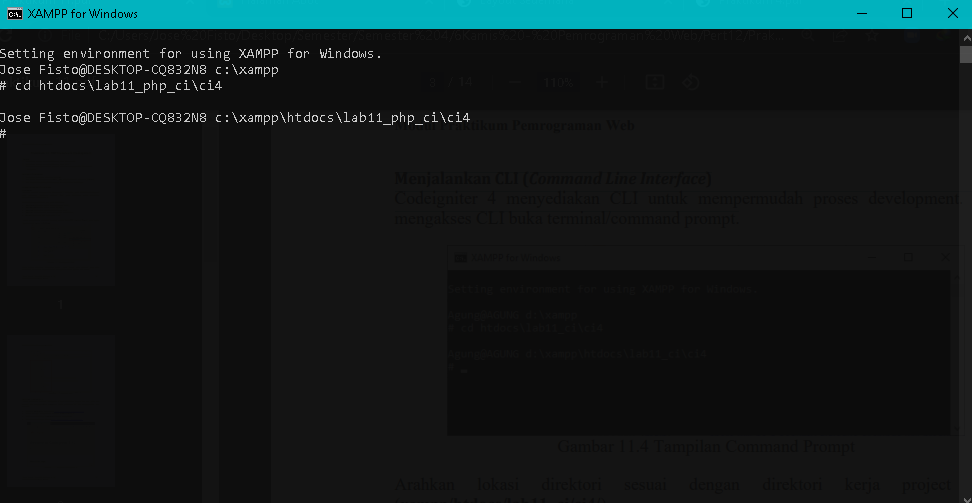
</p>

Arahkan lokasi direktori sesuai dengan direktori kerja project dibuat
(xampp/htdocs/lab11_ci/ci4/)

Perintah yang dapat dijalankan untuk memanggil CLI Codeigniter adalah:

```php
php spark
```

<p align="center">
	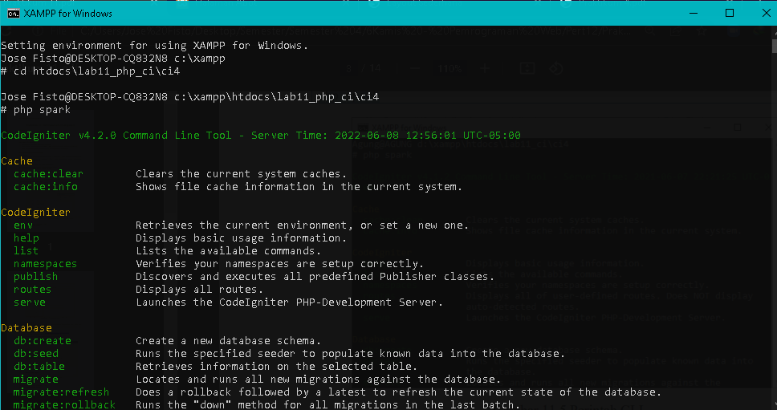
</p>

## Mengaktifkan Mode Debugging

Codeigniter 4 menyediakan fitur debugging untuk memudahkan developer untuk mengetahui pesan error apabila terjadi kesalahan dalam membuat kode program. Secara default fitur ini belum aktif.

Ketika terjadi error pada aplikasi akan ditampilkan pesan kesalahan seperti berikut.

<p align="center">
	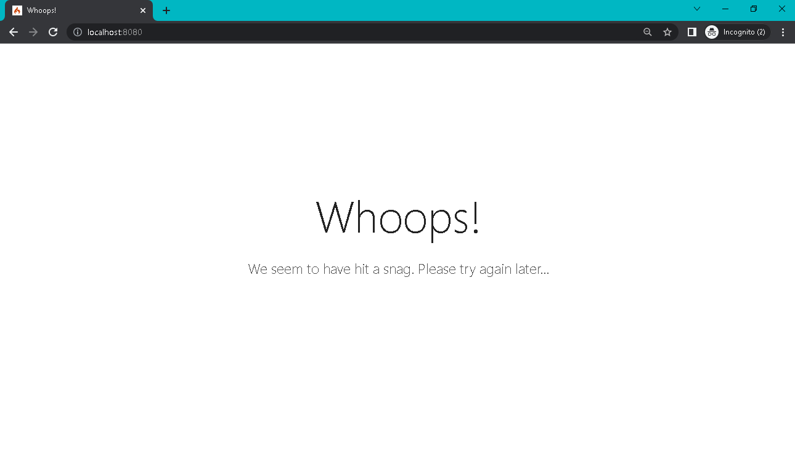
</p>

Semua jenis error akan ditampilkan sama. Untuk memudahkan mengetahui jenis
errornya, maka perlu diaktifkan mode debugging dengan mengubah nilai konfigurasi
pada environment variable **CI_ENVIRINMENT** menjadi **development**.

<p align="center">
	
</p>

Ubah nama file **env** menjadi .**env** kemudian buka file tersebut dan ubah nilai variable
**CI_ENVIRINMENT** menjadi development.

Kemudian ubah file **production.php** dalam folder **app\Config\Boot**, ganti value "0" menjadi "1", untuk memunculkan error pada halaman

<p align="center">
	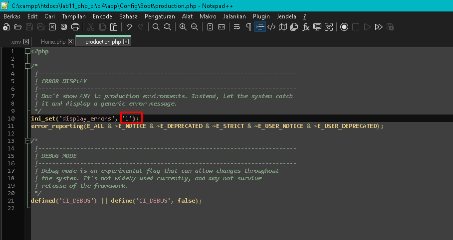
</p>

Sebagai contoh ubah file **app/Controller/Home.php** dengan menghilangkan titik koma (;) pada akhir kode.

<p align="center">
	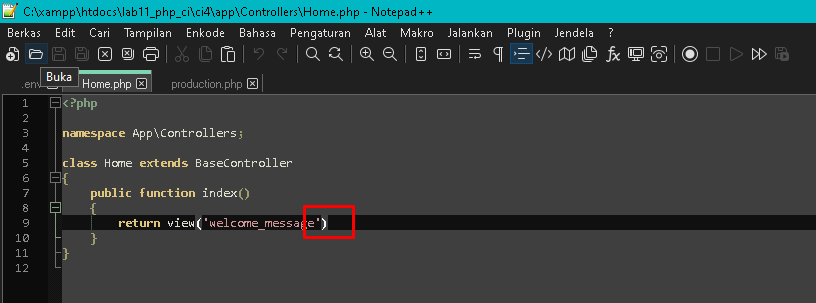
</p>

Selanjutnya load ulang halaman untuk melihat hasil error yang muncul :

<p align="center">
	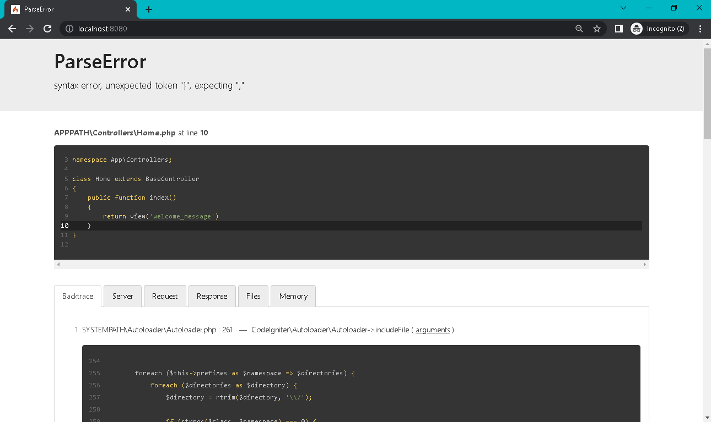
</p>

## Struktur Direktori

Untuk lebih memahami Framework Codeigniter 4 perlu mengetahui struktur direktori
dan file yang ada. Buka pada Windows Explorer atau dari Visual Studio Code ->
Open Folder.

Terdapat beberapa direktori dan file yang perlu dipahami fungsi dan kegunaannya.

- **.github** folder ini kita butuhkan untuk konfigurasi repo github, seperti konfigurasi untuk build dengan github action;
- **app** folder ini akan berisi kode dari aplikasi yang kita kembangkan;
- **public** folder ini berisi file yang bisa diakses oleh publik, seperti file index.php, robots.txt, favicon.ico, ads.txt, dll;
- **tests** folder ini berisi kode untuk melakukan testing dengna PHPunit;
- **vendor** folder ini berisi library yang dibutuhkan oleh aplikasi, isinya juga termasuk kode core dari system CI.
- writable folder ini berisi file yang ditulis oleh aplikasi. Nantinya, kita bisa pakai untuk menyimpan file yang di-upload, logs, session, dll. Sedangkan file-file yang berada pada root direktori CI sebagai berikut.
- **.env** adalah file yang berisi variabel environment yang dibutuhkan oleh aplikasi.
- **.gitignore** adalah file yang berisi daftar nama file dan folder yang akan diabaikan oleh Git.
- **build** adalah script untuk mengubah versi codeigniter yang digunakan. Ada versi release (stabil) dan development (labil).
- **composer.json** adalah file JSON yang berisi informasi tentang proyek dan daftar library yang dibutuhkannya. File ini digunakan oleh Composer sebagai acuan.
- **composer.lock** adalah file yang berisi informasi versi dari libraray yang digunakan aplikasi.
- **license.txt** adalah file yang berisi penjelasan tentang lisensi Codeigniter;
- **phpunit.xml.dist** adalah file XML yang berisi konfigurasi untuk PHPunit.
- **README.md** adalah file keterangan tentang codebase CI. Ini biasanya akan dibutuhkan pada repo github atau gitlab.
- **spark** adalah program atau script yang berfungsi untuk menjalankan server, generate kode, dll.

<p align="center">
	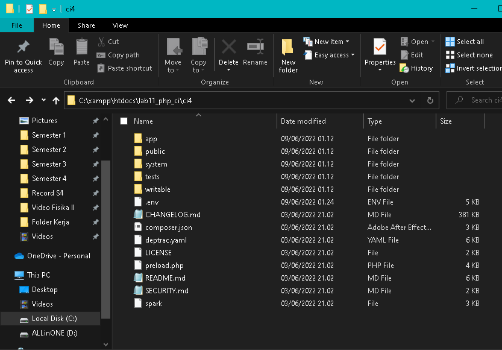
</p>

Fokus kita pada folder **app**, dimana folder tersebut adalah area kerja kita untuk
membuat aplikasi. Dan folder **public** untuk menyimpan aset web seperti css, gambar,
javascript, dll.

## Memahami Konsep MVC

Codeigniter menggunakan konsep MVC. MVC meripakan singkatan dari *Model-View-Controller*. MVC merupakan konsep arsitektur yang umum digunakan dalam pengembangan aplikasi. Konsep MVC adalah memisahkan kode program berdasarkan logic proses, data, dan tampilan. Untuk logic proses diletakkan pada direktori Contoller, Objek data diletakkan pada direktori Model, dan desain tampilan diletakkan pada direktori View.

Codeigniter menggunakan konsep pemrograman berorientasi objek dalam mengimplementasikan konsep MVC.

**Model** merupakan kode program yang berisi pemodelan data. Data dapat berupa database ataupun sumber lainnya.

**View** merupakan kode program yang berisi bagian yang menangani terkait tampilan user interface sebuah aplikasi. didalam aplikasi web biasanya pasti akan berhubungan dengan html dan css.

**Controller** merupakaan kode program yang berkaitan dengan logic proses yang menghubungkan antara view dan model. Controller berfungsi untuk menerima request dan data dari user kemudian diproses dengan menghubungkan bagian model dan view.

**Routing dan Controller**
Routing merupakan proses yang mengatur arah atau rute dari request untuk menentukan fungsi/bagian mana yang akan memproses request tersebut. Pada framework CI4, routing bertujuan untuk menentukan Controller mana yang harus merespon sebuah request. Controller adalah class atau script yang bertanggung jawab merespon sebuah request.

Pada Codeigniter, request yang diterima oleh file index.php akan diarahkan ke Router untuk meudian oleh router tesebut diarahkan ke Controller.

Router terletak pada file **app/config/Routes.php**

<p align="center">
	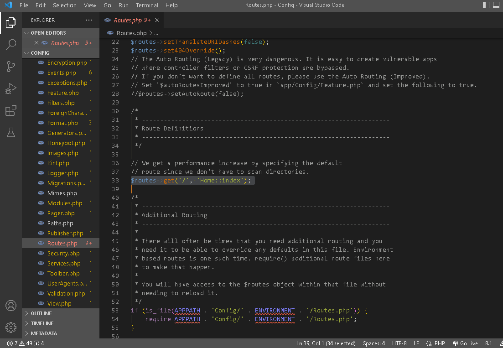
</p>

Pada file tersebut kita dapat mendefinisikan route untuk aplikasi yang kita buat.

```php
$routes->get('/', 'Home::index');
```

Kode tersebut akan mengarahkan rute untuk halaman home.

## Membuat Route Baru

Tambahkan kode berikut di dalam **Routes.php**

```php
$routes->get('/about', 'Page::about');
$routes->get('/contact', 'Page::contact');
$routes->get('/faqs', 'Page::faqs');
```

Untuk mengetahui route yang ditambahkan sudah benar, buka CLI dan jalankan perintah berikut.

```php
php spark routes
```

<p align="center">
	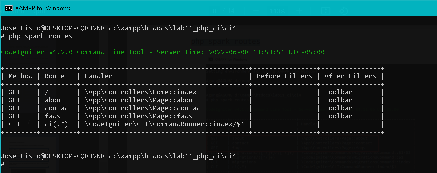
</p>

Selanjutnya coba akses route yang telah dibuat dengan mengakses alamat url http://localhost:8080/about

<p align="center">
	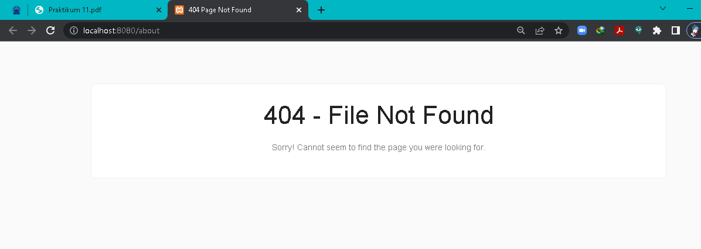
</p>

Ketika diakses akan mucul tampilan error 404 file not found, itu artinya file/page tersebut tidak ada. Untuk dapat mengakses halaman tersebut, harus dibuat terlebih dahulu Contoller yang sesuai dengan routing yang dibuat yaitu Contoller Page.

## Membuat Controller

Selanjutnya adalah membuat Controller Page. Buat file baru dengan nama **page.php** pada direktori Controller kemudian isi kodenya seperti berikut.

```php
<?php
namespace App\Controllers;
class Page extends BaseController
{
 public function about()
 {
 echo "Ini halaman About";
 }
 public function contact()
 {
 echo "Ini halaman Contact";
 }
 public function faqs()
 {
 echo "Ini halaman FAQ";
 }
}
```

Selanjutnya refresh Kembali browser, maka akan ditampilkan hasilnya yaitu halaman sudah dapat diakses.

<p align="center">
	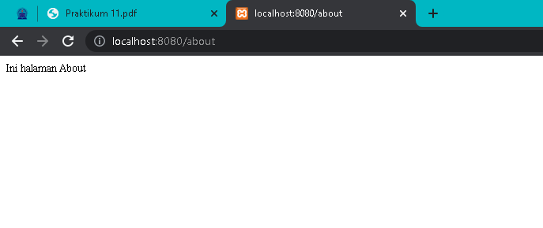
</p>

## Auto Routing

Secara default fitur autoroute pada Codeiginiter sudah aktif. Untuk mengubah status autoroute dapat mengubah nilai variabelnya. Untuk menonaktifkan ubah nilai true menjadi false.

```php
$routes->setAutoRoute(true);
```

Tambahkan method baru pada Controller Page seperti berikut

```php
public function tos()
{
 echo "ini halaman Term of Services";
}
```

Method ini belum ada pada routing, sehingga cara mengaksesnya dengan menggunakan alamat: http://localhost:8080/page/tos

<p align="center">
	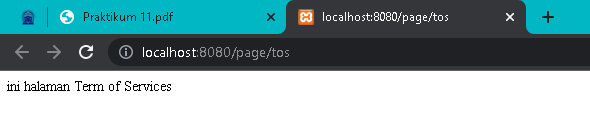
</p>

## Membuat View

Selanjutnya adalam membuat view untuk tampilan web agar lebih menarik. Buat file baru dengan nama about.php pada direktori view (**app/view/about.php**) kemudian isi kodenya seperti berikut.

```php
<!DOCTYPE html>
<html lang="en">
<head>
	<meta charset="UTF-8">
	<title><?= $title; ?></title>
</head>
<body>
	<h1><?= $title; ?></h1>
	<hr>
	<p><?= $content; ?></p>
</body>
</html>
```

Ubah **method about** pada class **Controller Page** menjadi seperti berikut:

```php
public function about()
{
	return view('about', [
		'title' => 'Halaman Abot',
		'content' => 'Ini adalah halaman abaut yang menjelaskan tentang isi halaman ini.'
	]);
}
```

Kemudian lakukan refresh pada halaman tersebut.

<p align="center">
	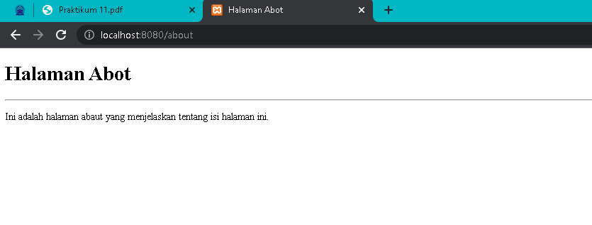
</p>

## Membuat Layout Web dengan CSS

Pada dasarnya layout web dengan css dapat diimplamentasikan dengan mudah pada codeigniter. Yang perlu diketahui adalah, pada Codeigniter 4 file yang menyimpan asset css dan javascript terletak pada direktori **public**.

Buat file css pada direktori **public** dengan nama **style.css** (copy file dari praktikum **lab4_layout**. Kita akan gunakan layout yang pernah dibuat pada praktikum 4.

<p align="center">
	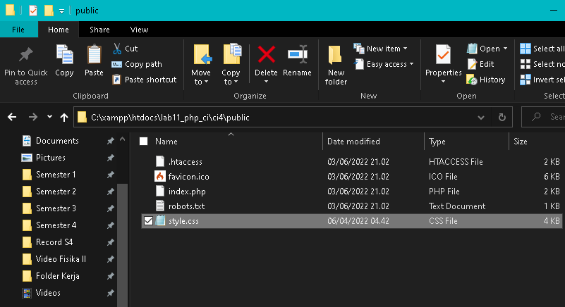
</p>

Kemudian buat folder template pada direktori view kemudian buat file **header.php** dan **footer.php**

File app/view/template/**header.php**

```php
<!DOCTYPE html>
<html lang="en">
<head>
	<meta charset="UTF-8">
	<title><?= $title; ?></title>
	<link rel="stylesheet" href="<?= base_url('/style.css');?>">
</head>
<body>
	<div id="container">
	<header>
		<h1>Layout Sederhana</h1>
	</header>
	<nav>
		<a href="<?= base_url('/');?>" class="active">Home</a>
		<a href="<?= base_url('/artikel');?>">Artikel</a>
		<a href="<?= base_url('/about');?>">About</a>
		<a href="<?= base_url('/contact');?>">Kontak</a>
	</nav>
	<section id="wrapper">
		<section id="main">
```
File app/view/template/**footer.php**

```php
	</section>
	<aside id="sidebar">
			<div class="widget-box">
				<h3 class="title">Widget Header</h3>
				<ul>
					<li><a href="#">Widget Link</a></li>
					<li><a href="#">Widget Link</a></li>
				</ul>
			</div>
			div class="widget-box">
				<h3 class="title">Widget Text</h3>
				<p>Vestibulum lorem elit, iaculis in nisl volutpat, malesuada tincidunt arcu. Proin in leo fringilla, vestibulum mi porta, faucibus felis. Integer pharetra est nunc, nec pretium nunc pretium ac.</p>
			</div>
		</aside>
	</section>
	<footer>
		<p>&copy; 2021 - Universitas Pelita Bangsa</p>
	</footer>
	</div>
</body>
</html>
```

Kemudian ubah file app/view/**about.php** seperti berikut.

```php
<?= $this->include('template/header'); ?>

<h1><?= $title; ?></h1>
<hr>
<p><?= $content; ?></p>

<?= $this->include('template/footer'); ?>
```

Selanjutnya refresh tampilan pada alamat http://localhost:8080/about

<p align="center">
	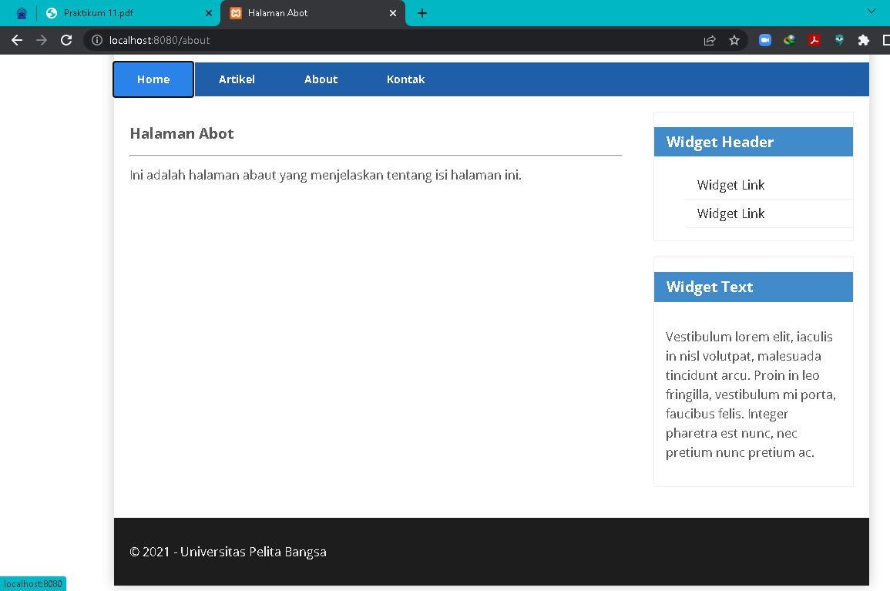
</p>

## Pertanyaan dan Tugas
Lengkapi kode program untuk menu lainnya yang ada pada Controller Page, sehingga semua link pada navigasi header dapat menampilkan tampilan dengan layout yang sama.

## Laporan Praktikum
1. Buatlah repository baru dengan nama Lab11Web.
2. Kerjakan semua latihan yang diberikan sesuai urutannya.
3. Screenshot setiap perubahannya.
4. Buatlah file README.md dan tuliskan penjelasan dari setiap langkah praktikum beserta screenshotnya.
5. Commit hasilnya pada repository masing-masing.
6. Kirim URL repository pada e-learning ecampus

Jawaban :

1. Pertama, lakukan perubahan atau tambahkan pada file **app/config/routes.php**

File **routes.php** :

<p align="center">
	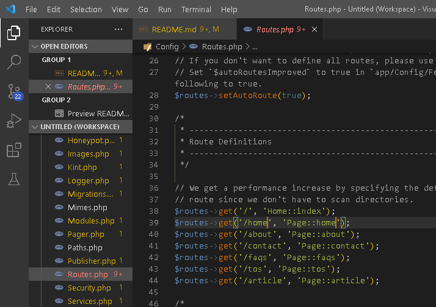
</p>

2. Kedua, lakukan pengeditan atau tambahkan pada file **app/controllers/page.php**

File **page.php** :

<p align="center">
	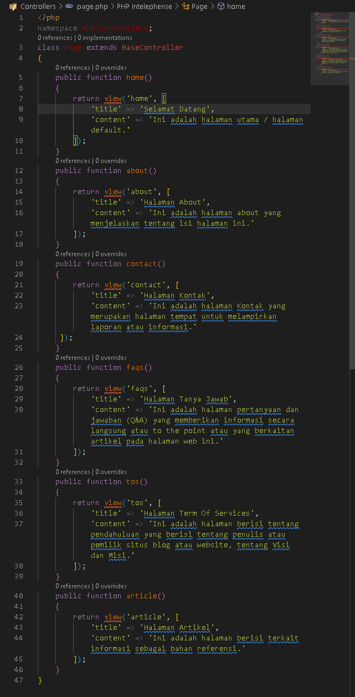
</p>

3. Ketiga, buat file baru atau tambahkan file pada direktori view **app/views**

File **home.php** :

<p align="center">
	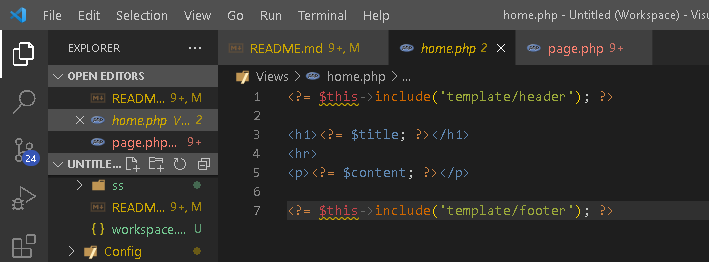
</p>

File **article.php** :

<p align="center">
	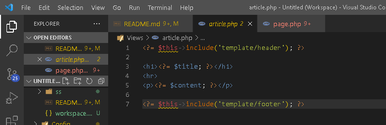
</p>

File **contact.php** :

<p align="center">
	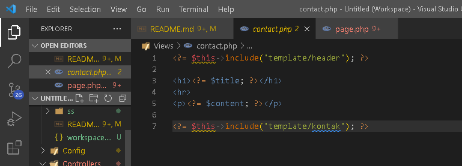
</p>

File **faqs.php** :

<p align="center">
	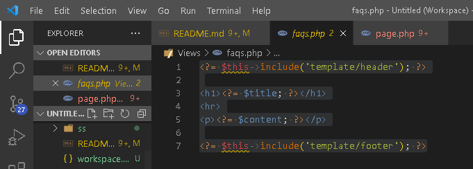
</p>

File **tos.php** :

<p align="center">
	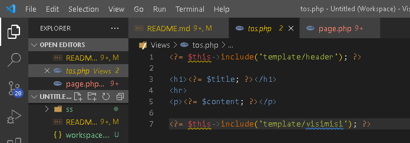
</p>

4. Keempat, tambahkan template baru (di **app/views/template**) yang di perlukan pada direktori **app/view**

File kontak.php :

<p align="center">
	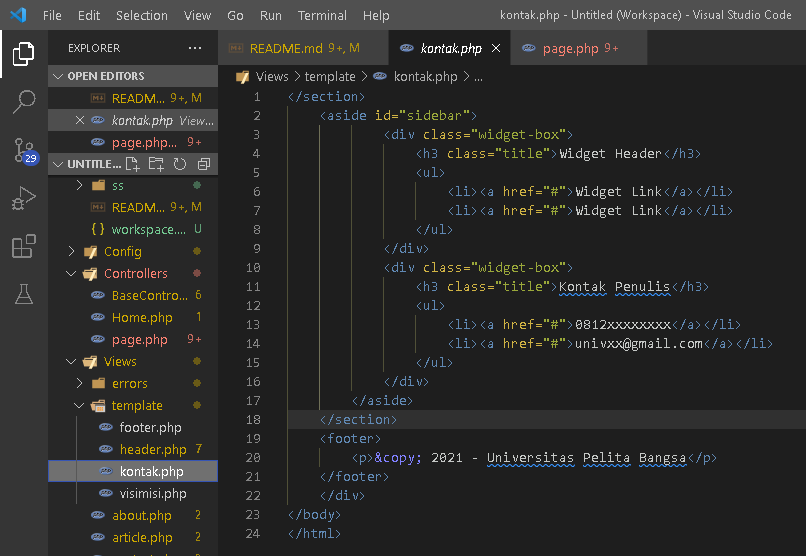
</p>

File visimis.php :

<p align="center">
	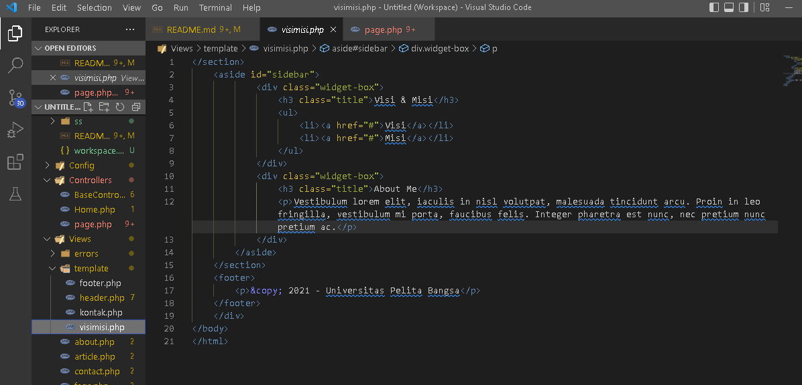
</p>

5. Kelima cek hasil semua tampilan semua layout

Tampilan layout Home :

<p align="center">
	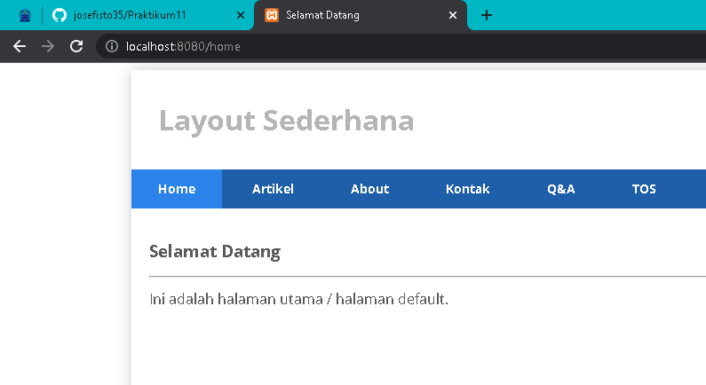
</p>

Tampilan layout Artikel :

<p align="center">
	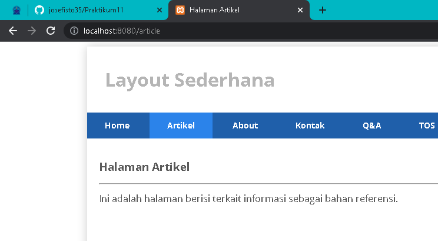
</p>

Tampilan layout About :

<p align="center">
	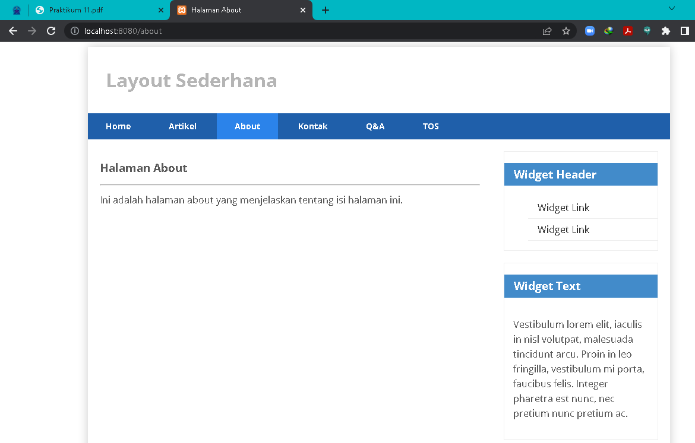
</p>

Tampilan layout Kontak :

<p align="center">
	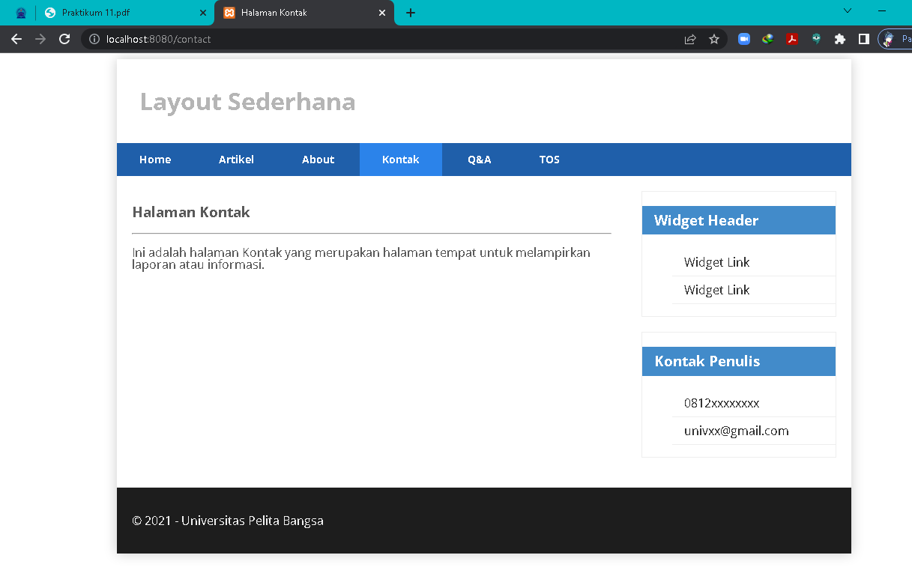
</p>

Tampilan layout Pertanyaan dan Jawaban :

<p align="center">
	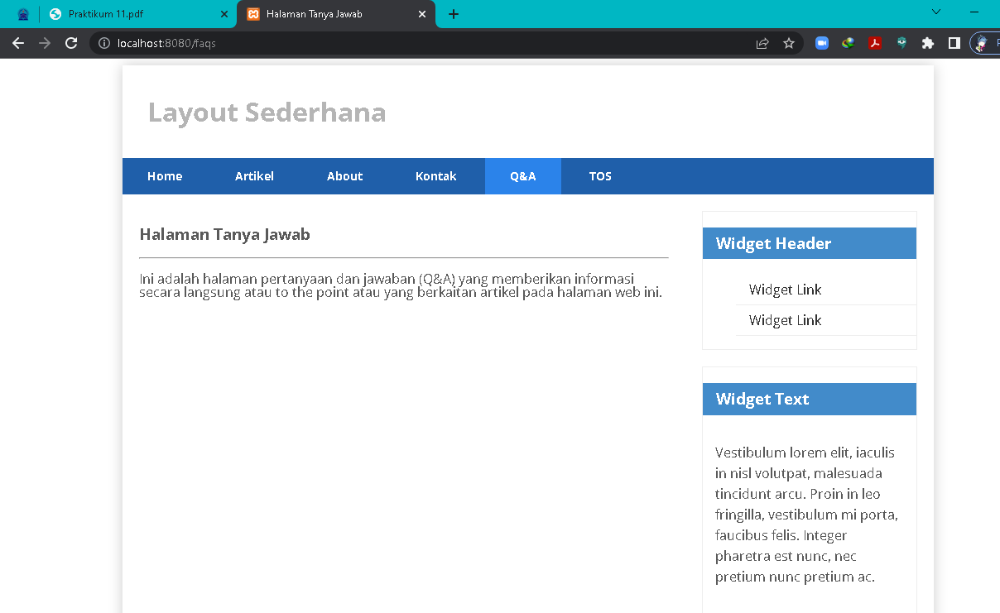
</p>

Tampilan layout Terms Of Services :

<p align="center">
	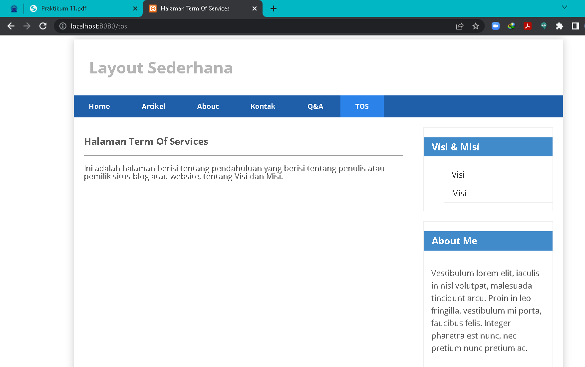
</p>